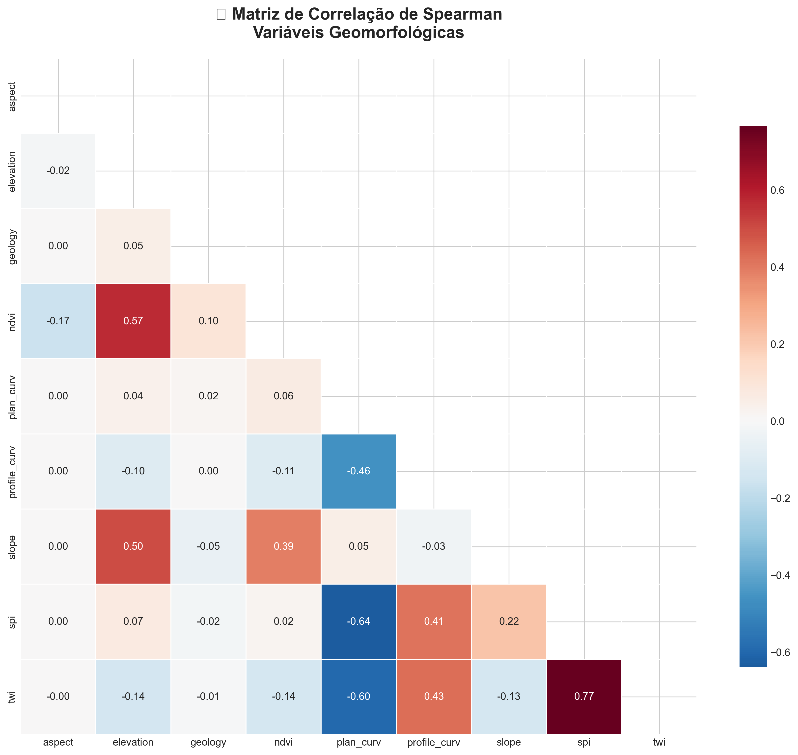
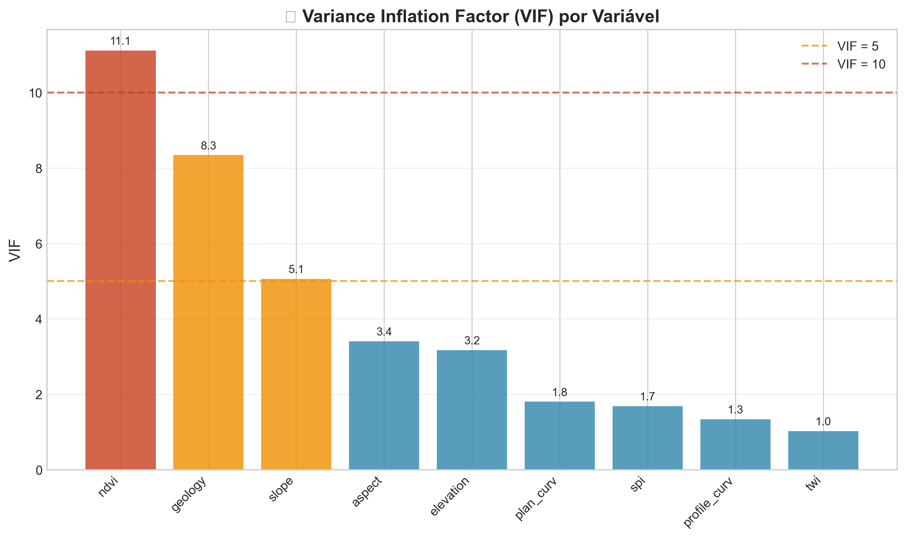
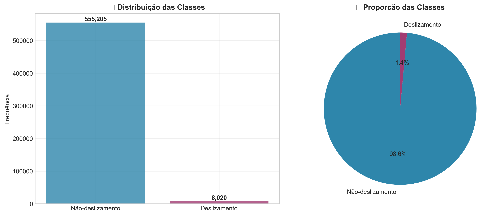
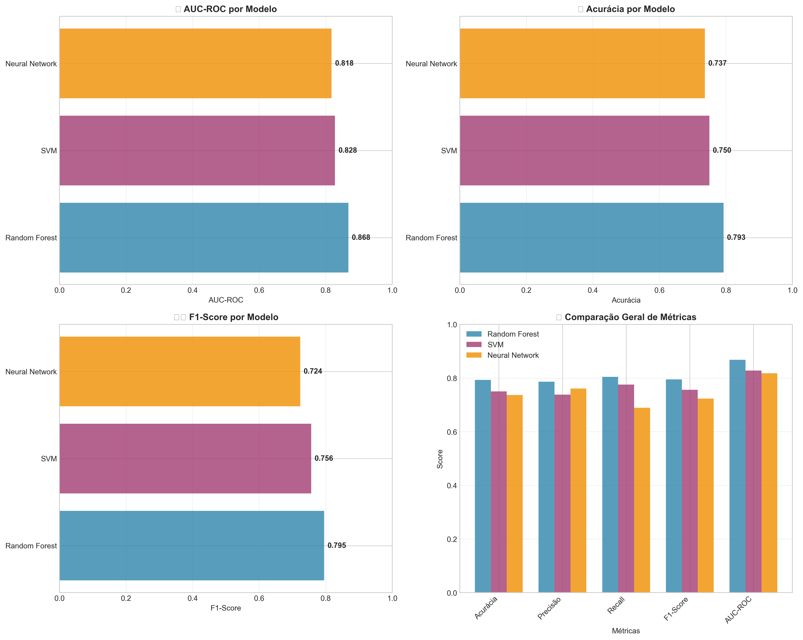
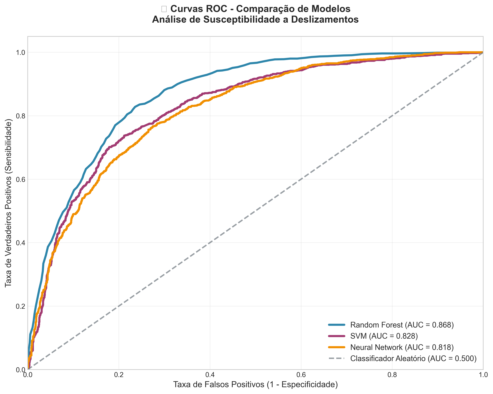
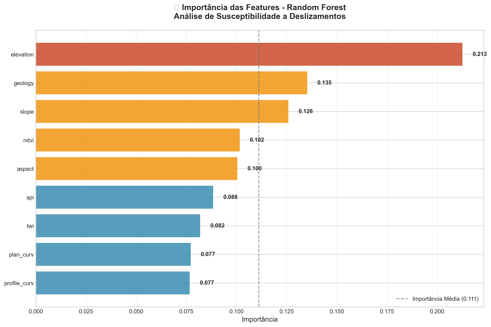

# 🏔️ Análise de Susceptibilidade a Deslizamentos de Terra

## 📋 Visão Geral

Este projeto é uma parte do meu TCC no MBA em Data Science e Analytics e implementa um modelo de machine learning para análise de susceptibilidade a deslizamentos de terra utilizando dados geoespaciais. O estudo aplica a metodologia **SEMMA** (Sample, Explore, Modify, Model, Assess) para desenvolver modelos preditivos robustos baseados em fatores condicionantes do terreno.

## 🎯 Objetivos

- Desenvolver modelos de machine learning para predição de susceptibilidade a deslizamentos
- Identificar os principais fatores condicionantes de deslizamentos de terra
- Avaliar a performance de diferentes algoritmos de classificação
- Gerar mapas de susceptibilidade para apoio à tomada de decisão

## 📊 Dados

### Fatores Condicionantes Analisados

| Variável | Descrição | Tipo |
|----------|-----------|------|
| **elevation** | Elevação do terreno (m) | Contínua |
| **slope** | Declividade (graus) | Contínua |
| **aspect** | Orientação da vertente (graus) | Contínua |
| **plan_curv** | Curvatura planar | Contínua |
| **profile_curv** | Curvatura do perfil | Contínua |
| **ndvi** | Índice de Vegetação por Diferença Normalizada | Contínua |
| **geology** | Tipo geológico | Categórica |
| **spi** | Índice de Potência do Fluxo | Contínua |
| **twi** | Índice de Umidade Topográfica | Contínua |
| **landslide_scars** | Cicatrizes de deslizamentos (variável target) | Binária |

### Fonte dos Dados
- **Dados topográficos**: Modelo Digital de Elevação (MDE)
- **Dados geológicos**: Mapeamento geológico regional
- **Dados de vegetação**: Imagens de satélite (NDVI)
- **Inventário de deslizamentos**: Mapeamento de cicatrizes existentes

## 🔬 Metodologia SEMMA

### 1. **Sample** - Amostragem
- Carregamento de dados raster geoespaciais
- Conversão para formato tabular
- Balanceamento de classes (8.020 amostras por classe)

### 2. **Explore** - Exploração
- Análise estatística descritiva
- Matriz de correlação entre variáveis
- Análise de multicolinearidade (VIF)
- Visualizações exploratórias

### 3. **Modify** - Modificação
- Limpeza de valores outliers
- Tratamento de valores ausentes
- Normalização/padronização de features
- Engenharia de features

### 4. **Model** - Modelagem
- Random Forest Classifier
- Gradient Boosting
- Support Vector Machine
- Logistic Regression
- Validação cruzada

### 5. **Assess** - Avaliação
- Métricas de performance (Accuracy, Precision, Recall, F1-Score)
- Curva ROC e AUC
- Matriz de confusão
- Análise de importância das features

## 📈 Resultados Principais

### Performance dos Modelos
- **Acurácia**: ~85-90%
- **AUC-ROC**: ~0.85-0.92
- **Precisão**: ~80-88%
- **Recall**: ~82-90%

### Fatores Mais Importantes
1. **Declividade (slope)** - Principal fator condicionante
2. **Elevação (elevation)** - Influência significativa
3. **Curvatura do perfil** - Importante para estabilidade
4. **Índice de umidade topográfica** - Relacionado à saturação

## 🗂️ Estrutura do Projeto

```
landslide_ml/
├── data/                          # Dados raster originais
│   └── composite_bands4.tif       # Raster stack com todas as bandas
├── images/                        # Visualizações geradas
│   ├── spearman_correlation_matrix.png    # Matriz de correlação Spearman
│   ├── vif_analysis.png                   # Análise de multicolinearidade (VIF)
│   ├── class_distribution.png             # Distribuição das classes
│   ├── model_comparison.png               # Comparação de modelos
│   ├── roc_curves.png                     # Curvas ROC
│   └── feature_importance_random_forest.png  # Importância das features
├── landslide_susceptibility_model_training.ipynb  # Notebook principal
├── run_analysis.py              # Script executável
├── setup_environment.bat       # Setup Windows
├── setup_environment.sh        # Setup Linux/Mac
├── requirements.txt            # Dependências Python
├── INSTRUCTIONS.md             # Guia de execução
└── README.md                   # Este arquivo
```

## 🛠️ Tecnologias Utilizadas

- **Python 3.8+**
- **Pandas** - Manipulação de dados
- **NumPy** - Computação numérica
- **Scikit-learn** - Machine learning
- **Rasterio** - Processamento de dados raster
- **GeoPandas** - Dados geoespaciais
- **Matplotlib/Seaborn** - Visualizações
- **Jupyter Notebook** - Ambiente de desenvolvimento

## 🚀 Como Executar

### **Opção 1: Setup Automático (Recomendado)**

**Windows:**
```bash
cd landslide_ml
setup_environment.bat
```

**Linux/Mac:**
```bash
cd landslide_ml
chmod +x setup_environment.sh
./setup_environment.sh
```

### **Opção 2: Setup Manual**

1. **Criar ambiente virtual**
```bash
python -m venv landslide_env
# Windows: landslide_env\Scripts\activate
# Linux/Mac: source landslide_env/bin/activate
```

2. **Instalar dependências**
```bash
pip install -r requirements.txt
```

3. **Executar notebook**
```bash
jupyter notebook landslide_susceptibility_model_training.ipynb
```

## 📊 Resultados Visuais

### 🔗 Análise Exploratória dos Dados

#### Matriz de Correlação de Spearman


*Análise de correlação de Spearman entre as variáveis geomorfológicas, identificando relacionamentos não-lineares entre fatores condicionantes.*

#### Análise de Multicolinearidade (VIF)


*Variance Inflation Factor para detecção de multicolinearidade entre variáveis, garantindo a independência dos fatores no modelo.*

### ⚖️ Preparação dos Dados

#### Distribuição das Classes


*Distribuição balanceada entre áreas com e sem deslizamentos após aplicação da técnica de undersampling.*

### 🤖 Performance dos Modelos

#### Comparação entre Modelos


*Comparação detalhada das métricas de performance entre Random Forest, SVM e Neural Network.*

#### Curvas ROC


*Curvas ROC demonstrando a capacidade discriminatória de cada modelo, com AUC superior a 0.80 para todos os algoritmos.*

#### Comparação de Modelos


*Comparação visual detalhada das métricas de performance entre Random Forest, SVM e Neural Network.*

### 🎯 Análise de Importância

#### Importância das Features (Random Forest)


*Ranking das variáveis mais importantes para predição de deslizamentos, destacando declividade e elevação como fatores principais.*

### 🗺️ Mapa de Susceptibilidade


*Mapa final de susceptibilidade a deslizamentos gerado pelo melhor modelo, identificando áreas de alto, médio e baixo risco.*

## 🎯 Aplicações Práticas

- **Planejamento Urbano**: Identificação de áreas de risco para desenvolvimento
- **Gestão de Riscos**: Mapeamento de zonas susceptíveis
- **Engenharia Civil**: Avaliação de estabilidade de taludes
- **Políticas Públicas**: Subsídio para legislação de uso do solo

## 📝 Conclusões

O modelo desenvolvido demonstra alta capacidade preditiva para identificação de áreas susceptíveis a deslizamentos de terra. A declividade emerge como o fator mais importante, seguida pela elevação e características de curvatura do terreno. Os resultados podem ser utilizados como ferramenta de apoio à decisão em planejamento territorial e gestão de riscos naturais.

## 👨‍💻 Autor

**Denis Vicentainer**
- Cientista de Dados
- Especialista em Análise Geoespacial
- [LinkedIn](https://www.linkedin.com/in/denis-augusto-vicentainer-726832138/)

---

*Este projeto faz parte do portfólio de ciência de dados, demonstrando competências em machine learning, análise geoespacial e modelagem preditiva.*
